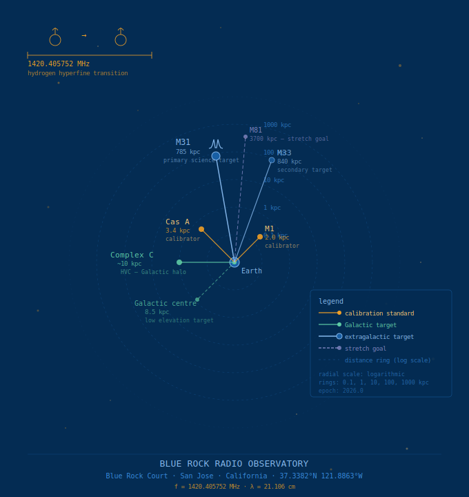

# Blue Rock Radio Observatory

**HI Observation Log**



**Observer:** Steve Hawker  
**Observatory:** Blue Rock Radio Observatory, Blue Rock Court, San Jose, California, USA  
**Latitude:** 37.3382° N  
**Longitude:** -121.8863° W  
**Elevation:** ~25m ASL  
**Program start:** 2026-04-28  
**Repository:** https://github.com/Steve-Hawker/blue-rock-radio-observatory

---

## Observer

Steve Hawker BEng MBA FRAS  
BSc Honours Astronomy (Distance Learning), University of Lancashire  
Fellow of the Royal Astronomical Society (FRAS)  
Member, Society of Amateur Radio Astronomers (SARA)  
Member, San Jose Astronomical Association (SJAA)

*Blue Rock Radio Observatory is located on Blue Rock Court, San Jose, California.*

---

## Program Purpose

Systematic hydrogen line (1420.405 MHz) observing program in support of BSc Honours
thesis and potential MRes research. Primary science goals:

- HI velocity mapping of M31 (Andromeda Galaxy)
- High-velocity cloud (HVC) monitoring — Complex C
- Galactic HI emission along selected sightlines
- RFI environment characterisation at 1420 MHz from an urban site, San Jose CA

---

## Repository Structure

```
blue-rock-radio-observatory/
├── README.md                        ← this file
├── RESEARCH_PLAN.md                 ← full 3-year programme plan
├── LEARNING_PLAN.md                 ← structured self-study programme
├── TOOLS_PLAN.md                    ← tools roles and workflow
├── QUICK_REFERENCE.md               ← pre/post session checklists and key data
├── .gitignore                       ← excluded files (credentials, data, clutter)
├── equipment/                       ← versioned equipment state records
│   └── E001_YYYY-MM-DD.md
├── sessions/                        ← per-observation session logs
│   └── YYYY/
│       └── YYYY-MM-DD_TARGET.md
├── calibration/                     ← calibration time series and notes
│   └── CasA_timeseries.csv
├── targets/                         ← static reference data for each target
│   ├── M1_CrabNebula.md
│   ├── M31.md
│   ├── CasA.md
│   └── ComplexC_HVC.md
├── rfi/                             ← RFI environment characterisation
│   ├── RFI_OVERVIEW.md
│   └── SURVEY_TEMPLATE.md
├── investigations/                  ← structured engineering investigations
│   ├── INVESTIGATIONS.md
│   ├── INV001_noise_budget/
│   ├── INV002_digital_filters/
│   └── INV003_rfi_flagging/
├── writing/                         ← chapter outlines, thesis drafts, notes
│   ├── SITE_ASSESSMENT_CHAPTER_OUTLINE.md
│   ├── M1_VECTOR_ANALYSIS.md
│   └── (thesis drafts as developed)
├── branding/                        ← visual identity and observatory graphics
│   ├── LOGO_DESIGN_BRIEF.md
│   ├── BRRO_target_map.svg
│   └── BRRO_target_map_badge.svg
└── setup/                           ← hardware and software setup guides
    └── RASPBERRY_PI_SETUP.md
```

---

## Equipment Summary

- **Antenna:** 70cm parabolic dish, AZ/EL tracking mount
- **Signal chain:** Antenna → LNA1 (QPL9547) → SAW Filter → LNA2 → SAW Filter → SDR
- **Target frequency:** 1420.405 MHz (hydrogen line)
- **Software:** EZRa / GNU Radio

Full equipment details in `equipment/E001_YYYY-MM-DD.md`.

---

## Equipment Log Versioning

Every change to the signal chain creates a new equipment version (E001, E002, ...).
Session logs reference the equipment version in effect at time of observation.
This ensures full traceability of how any system change affects the data.

---

## Time Standard

**All times in UTC.** Local time (PST/PDT) may be noted parenthetically but
UTC is the primary record. LST is recorded at session start.

---

## Calibration Standard

Cassiopeia A (Cas A) is used as the primary flux calibration standard.  
Known flux at 1420 MHz: ~2723 Jy (epoch J2000, Baars et al. 1977 scale).  
Secular decrease: ~0.77% per year.

---

## Primary Targets

| Target | Type | Priority | Best season |
|---|---|---|---|
| Cas A | SNR / calibrator | Primary | Year-round |
| M31 | Spiral galaxy | Primary science | Sep — Jan |
| Complex C | High-velocity cloud | Primary science | Year-round |
| M1 | Pulsar wind nebula | Secondary / calibrator | Oct — Feb |
| M33 | Spiral galaxy | Secondary | Sep — Jan |

