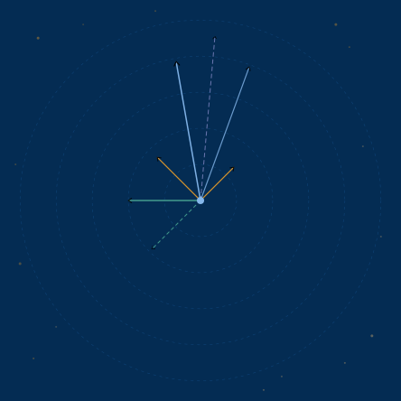

# Blue Rock Radio Observatory — Logo Design Brief

**Client:** Steve Hawker BEng MBA FRAS  
**Observatory:** Blue Rock Radio Observatory, San Jose, California  
**Date:** 2026-04-30  
**Version:** 1.1 — refined direction  

---

## About the Observatory

Blue Rock Radio Observatory is a serious amateur radio astronomy facility
conducting systematic hydrogen line (HI, 1420.405 MHz) observations of
extragalactic targets including M31 (Andromeda Galaxy) and Galactic
high-velocity clouds. The name derives from the observatory's location
on Blue Rock Court, San Jose, California.

The programme is affiliated with the University of Lancashire BSc Honours
Astronomy degree and the Society of Amateur Radio Astronomers (SARA).
The observer is a Fellow of the Royal Astronomical Society (FRAS).

---

## Audience

- Amateur radio astronomy community (SARA proceedings, publications)
- Academic astronomy community (University of Lancashire, thesis, FRAS)
- General public interested in citizen science

---

## Tone

Serious, scientific, credible — not whimsical. This is a real research
programme producing publishable results. The logo must feel at home
simultaneously on:

- A SARA proceedings paper header
- A GitHub repository
- A BSc Honours thesis title page
- An observatory identification plate

Think instrument, not hobby. Precision, not decoration.

---

## The Voyager Plaque Reference — the Essential Inspiration

The Pioneer plaque and Voyager Golden Record are the primary aesthetic
reference for this logo. Study them before designing.

The Pioneer plaque works because it encodes real scientific information
as graphic design — the pulsar timing map uses actual pulsar signatures
as radiating lines. It is simultaneously a navigation chart and a piece
of art. The information IS the design. It carries meaning for anyone
who knows what they're looking at, and visual beauty for everyone else.

The Voyager Golden Record used the hydrogen line (1420.405 MHz) as a
unit of time in the instructions for playing the record — because any
technological civilisation capable of radio astronomy would recognise it.
It is the universal frequency.

**This logo should carry that lineage.** It encodes real scientific
information — the hydrogen line spectral signature — in a material
object — lapis lazuli — that is itself named for the colour of the
sky. Ancient stone, ancient signal, modern instrument.

---

## The Lapis Lazuli Connection

The observatory name Blue Rock is a direct reference to lapis lazuli —
the deep blue semi-precious stone, historically the most precious pigment
in existence, flecked with irregular gold pyrite inclusions.

Lapis lazuli is:
- Geologically ancient — formed ~65 million years ago
- Astronomically connected — ultramarine pigment was used in medieval
  manuscript illustrations of the heavens
- Visually distinctive — deep blue with organic gold veining, unlike
  any synthetic colour

The lapis palette:
- **Primary:** Deep lapis blue — rich, dark, slightly purple-tinted
- **Accent:** Gold pyrite — warm irregular gold, not symmetrical, not decorative
- **Feel:** Geological, dense, precious, ancient — not decorative, not corporate

The gold pyrite inclusions must feel *organic and geological* — irregular
fracture patterns, not geometric ornament.

---

## The Chosen Direction — The Mineral Strip

A horizontal or vertical strip of lapis lazuli texture with the hydrogen
line spectral signature encoded within or across it in gold.

### Why this works

The strip of lapis is ancient geological material — billions of years of
pressure and heat crystallised into this specific blue. Running across it,
encoded in gold like the pyrite inclusions themselves, is the hydrogen
line — the signature of the most abundant element in the universe,
the signal that has travelled 2.5 million light years from M31 to be
detected by a 70cm dish on a patio in San Jose.

The oldest element in the universe, encoded in the oldest blue pigment
known to humanity, detected by an instrument named after the stone it
resembles. That is the logo.

### The spectral element

Two options for the spectral signature — the designer should judge which
reads better at various sizes:

**Option 1 — The M31 double-horn profile**
The characteristic double-peaked HI emission profile of M31 (Andromeda
Galaxy), the observatory's primary science target. Two peaks separated
by a valley — the signature of a rotating inclined disk. Recognisable
to any radio astronomer.

**Option 2 — The single HI line at 1420.405 MHz**
A single sharp vertical line marking the hydrogen rest frequency —
cleaner, more abstract, more universal. The number 1420.405 may appear
as a label, as on a scientific instrument scale.

The spectral element should be rendered in gold — warm, precise, embedded
in the lapis as naturally as the pyrite inclusions surrounding it.

### Vector map assets — included in this package

Two SVG files are included alongside this brief. Both are provided as
raw material for the designer — not as final artwork, but as precise
scientific diagrams that may inform the composition or be incorporated
directly into the logo design.

**BRRO_target_map.svg** — the full annotated vector map with legend,
HI frequency annotation, and observatory identification. Shows the
complete scientific context. Use as reference and for understanding
the programme.

**BRRO_target_map_badge.svg** — the minimal version: seven vectors,
distance rings, pyrite flecks, Earth dot. No annotations. This is
the raw mark — clean enough to use directly as a logo element or
to inspire the mineral strip composition.

The minimal badge in particular carries the Voyager plaque aesthetic
directly — encoded scientific information as graphic design, readable
to anyone with the knowledge, beautiful to everyone else. The designer
should study both files before beginning work.

---
- **Horizontally** — the spectrum runs left to right across the lapis,
  wordmark above or below
- **Vertically** — the strip runs top to bottom beside the wordmark,
  spectrum encoded vertically

The wordmark **Blue Rock Radio Observatory** sits alongside in a clean
geometric sans-serif. The strip and wordmark together form the complete
mark.

---

## Wordmark

**Text:** Blue Rock Radio Observatory

**Typeface direction:** Geometric sans-serif — clean, precise, scientific.
Alternatives: a serif with engineering gravitas. No script, no display
fonts, nothing decorative.

**Hierarchy:** "Blue Rock" may be weighted more heavily than "Radio Observatory"
if a two-line treatment is used.

---

## Deliverables

- Primary logo — full colour (lapis blue + gold pyrite + wordmark)
- Monochrome version — single colour for thesis and papers
- Icon/badge version — the mineral strip alone, works at small sizes
  (GitHub avatar, document header, observatory identification)
- Reversed version — light on dark background for dark contexts

---

## What to Avoid

- Generic telescope silhouettes — this is a radio observatory
- Stars, planets, galaxies as illustration — the science is encoded
  in the spectrum, not depicted as imagery
- Cartoon or whimsical treatment
- Gradients, lens flares, glow effects
- Symmetrical gold ornament — pyrite inclusions are irregular and organic
- Anything that looks like a WiFi symbol
- Blue that reads as corporate or digital rather than geological

---

## Reference Images Included in This Package

- **BRRO_target_map.svg** — full annotated vector map
- **BRRO_target_map_badge.svg** — minimal badge version — the raw mark
- Pioneer 10/11 plaque — note how scientific information becomes graphic design
- Voyager Golden Record cover — the HI line used as a unit of measurement
- High quality photographs of raw lapis lazuli with visible pyrite inclusions
- HI spectral profile of M31 — double-horn shape (available from HI4PI survey)
- The number: 1420.405 MHz

---

## What Success Looks Like

The logo is immediately legible at business card size. It looks credible
on a SARA journal paper. It is distinctive enough that someone seeing it
twice recognises it.

For anyone who knows radio astronomy: they see the HI line encoded in
lapis and understand immediately what this observatory does and why it
is named what it is.

For anyone who does not: they see a beautiful object — ancient blue stone
with gold inclusions and a precise scientific mark — and understand that
this is serious work.

The Voyager plaque works for both audiences simultaneously. This logo
should too.

---

## Version History

| Version | Date | Changes |
|---|---|---|
| 1.0 | 2026-04-30 | Initial brief — three concept directions |
| 1.1 | 2026-04-30 | Refined to mineral strip direction — Voyager plaque reference added |
| 1.2 | 2026-04-30 | SVG vector map assets incorporated — full and minimal badge versions |
